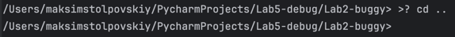
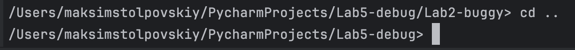

## Ошибка 1 - ошибка состояния

### Место - `main.py`, метод `run`, вызов функции `cd`

### Симптом:
При смене рабочей директории выводимый путь не меняется

### Как воспроизвести:
```cd ..```

### Отладка:
Установлен breakpoint на условие `case "cd"`
Видно, что после выполнения смены директории путь остается тем же

### Причина:
Новый путь не передается в `self.cwd`

### Исправление:
```Cd(self.cwd).change_dir(args)```

**Заменено на:**

```self.cwd = Cd(self.cwd).change_dir(args)```

### Проверка:
Путь меняется

### Доказательства:
**До:**

**После:**
