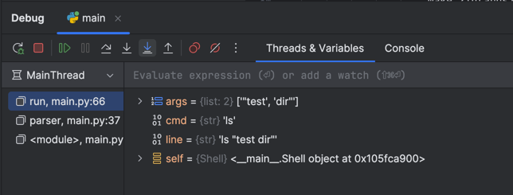
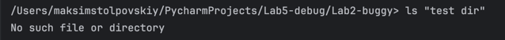
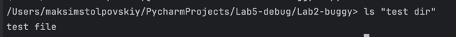

## Ошибка 2 - неправильный разбор строки или входных данных

Место - `main.py`, метод `run`

### Симптом:
При вводе имени папки с пробелом в кавычках программа не может обработать его, а при вводе без кавычек будет разбивать слова по пробелу на аргументы

### Как воспроизвести:
```ls "test dir"```

### Отладка:
Установлен breakpoint на разбиении строки на команду и аргументы 

### Причина:
Строка разбивается на несколько аргументов по пробелу из-за split

### Исправление:
Использовать shlex.split(), который принимает аргумент в кавычках за единый

#### Было:
```cmd, *args = line.strip().split()```

#### Заменено на:
```cmd, *args = shlex.split(line.strip())```

### Доказательства:



**До:**



**После:**

