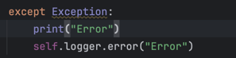
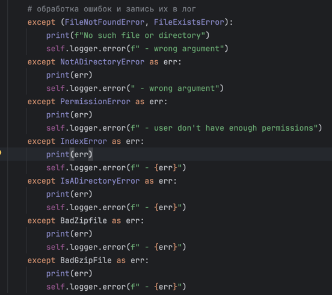
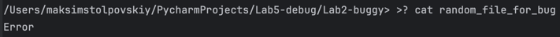
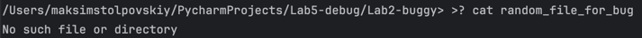
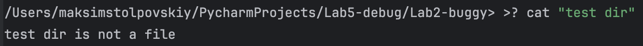

### Ошибка 3 - перехват слишком общего исключения

Место - `main.py`, метод `run`

### Симптом:
При некорректном вводе в консоль выводится `Error` при любой ошибке

### Как воспроизвести:
`cat random_file_for_bug`

### Отладка:
Установить breakpoint на `except Exception`

### Причина:
Из-за общего перехвата `except Exception` теряется ошибка и понять в чем она заключается проблематично

### Исправление:
Убрать `except Exception` и более подробно обработать ошибки (`PermissionError`, `FileNotFoundError`, `NotADirectoryError`, `IsADirectoryError`, `FileExistsError`, `IndexError`, `BadGzipFile`, `BadZipFile`)
Также добавить более подробное описание ошибок при каждом raise в других файлах

**Было:**

**Стало:**

### Доказательства:
**До:**

**После:**

