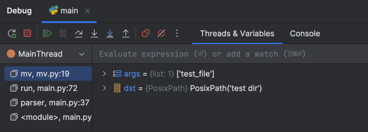
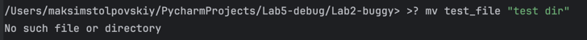
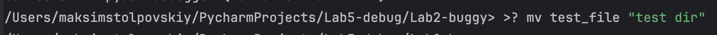

## Ошибка 4 - перепутанные аргументы

Место - `mv.py`, метод `mv`

### Симптом:
Команда пытается перенести назначение в источник и выдает ошибку или переносит не то

### Как воспроизвести:
`mv test_file "test dir"`

### Отладка:
Установить breakpoint на `shutil.move()`

### Причина:
Перепутанные аргументы в вызове `shutil.move()`

### Исправление:
`shutil.move(dst, Path(args[0]))`

**Заменено на:**

`shutil.move(Path(args[0]), dst)`

### Доказательства:

**Было:**

**Стало:**

