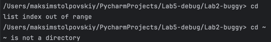
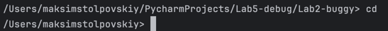
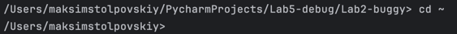

## Ошибка 5 - перепутанные аргументы

Место - `cd.py`, метод `change_dir`

### Симптом:
`cd` выдает ошибку при вводе пустого символа или `~`

### Как воспроизвести:
`cd ~` или `cd`

### Отладка:
Установить breakpoint на условие if

### Причина:
Неверная логическая операция (`and`)

### Исправление:
Нужно заменить `and` на `or`

Заменено на:

`if not args or args[0] == "~"`

### Доказательства:
**До:**

**После:**

